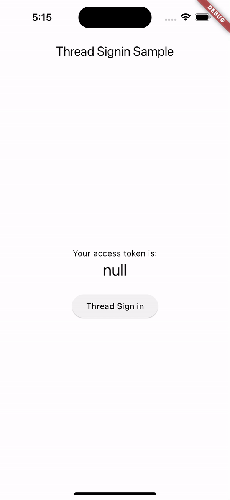

# thread_signin package

Get AccessToken Using Thread API https://pub.dev/packages/thread_signin

## Getting Started

Add Package dependency 
```yaml
thread_signin: ^1.0.0+1
```

or 

```sh 
$ flutter pub add thread_signin
```

## How to use 
```dart
    
    // create required params
    var params = ThreadSignInParams(
      clientId: 'XXXXXXXXXXXXXXXXXXXXXXXXXXXXXX',
      clientSecret: 'XXXXXXXXXXXXXXXXXXXXXXXXXX',
      redirectUrl: 'http://localhost:3000/auth/thread/callback',
      scopes: 'threads_basic',
    );

    // Push [ThreadSigninScreen] to perform login then get the [ThreadSignInResponse]
    Navigator.of(context).push(MaterialPageRoute(builder: (builder) {
      return ThreadSigninScreen(
        params: params,
        title: '',
      );
    })).then((value) {
      
    });

```

## Showcase 


## Contributing
Contributions are what make the open-source community such an amazing place to learn, inspire, and create. Any contributions you make are greatly appreciated.

1. Fork the Project
2. Create your Feature Branch (git checkout -b feature/AmazingFeature)
3. Commit your Changes (git commit -m 'Add some AmazingFeature')
4.  Push to the Branch (git push origin feature/AmazingFeature)
5. Open a Pull Request

## License
Distributed under the MIT License. See LICENSE for more information.